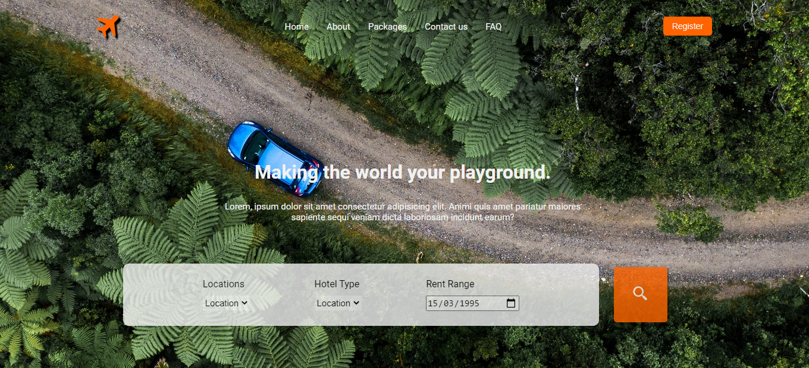
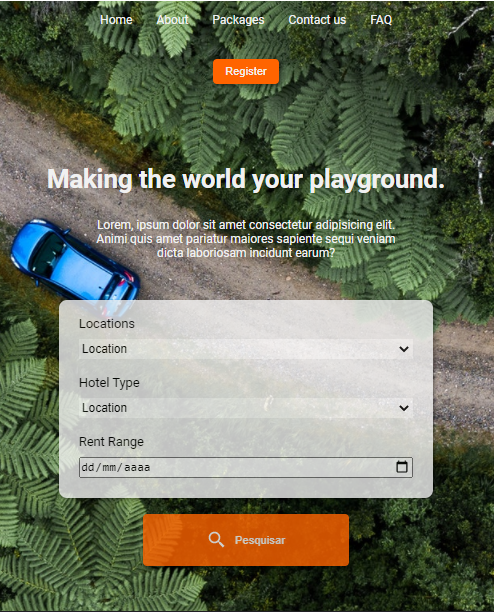

<h1 align="center">
  Travel
</h1>

  <a href="#-tecnologias">Tecnologias</a>&nbsp;&nbsp;&nbsp;|&nbsp;&nbsp;&nbsp;
  <a href="#-projeto">Projeto</a>&nbsp;&nbsp;&nbsp;|&nbsp;&nbsp;&nbsp;
  <a href="#memo-licença">Licença</a>

  

 

<h1>Desktop</h1>

  

<h1>Mobile</h1>

  

---

## 🚀 Tecnologias

Esse projeto será desenvolvido com as seguintes tecnologias:

- HTML
- CSS

## 🚧 Projeto

Neste desafio foi construida uma landing page de viagens fictícia.

## 🎨 Inspiração:

[Dribbble](https://dribbble.com/shots/17407084-Travel-Web-Header-Landing-Page-design/attachments/12533821?mode=media)

## :memo: Licença

Esse projeto está sob a licença MIT. Veja o arquivo [LICENSE](.github/LICENSE)

---
